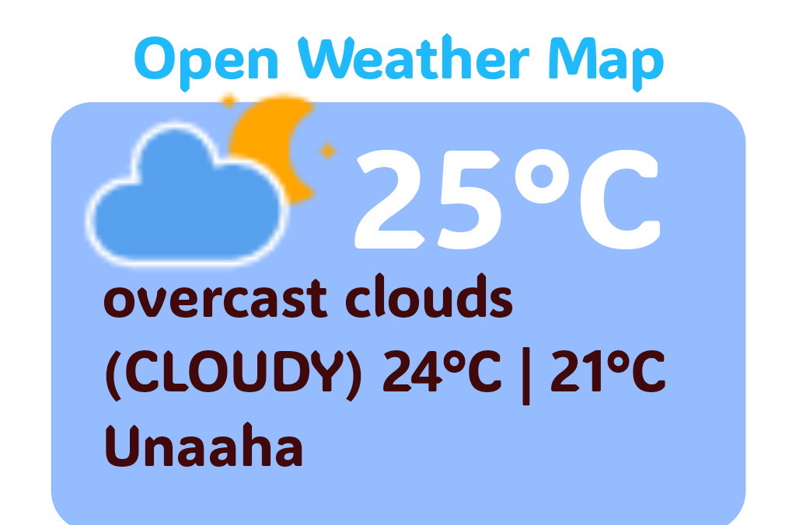
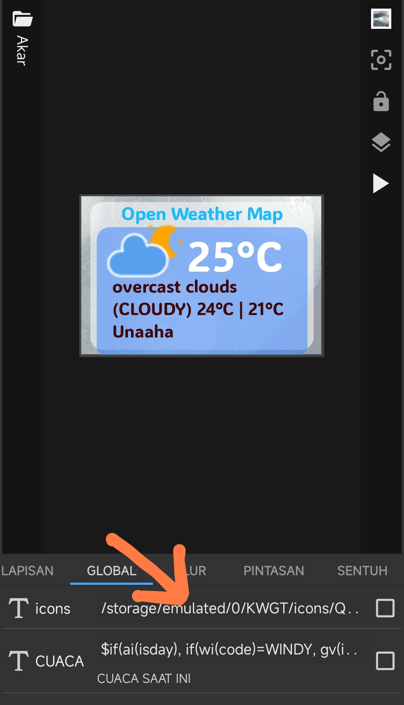
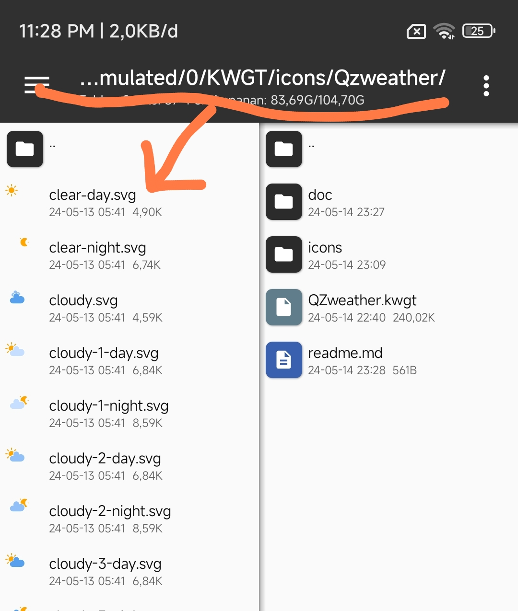
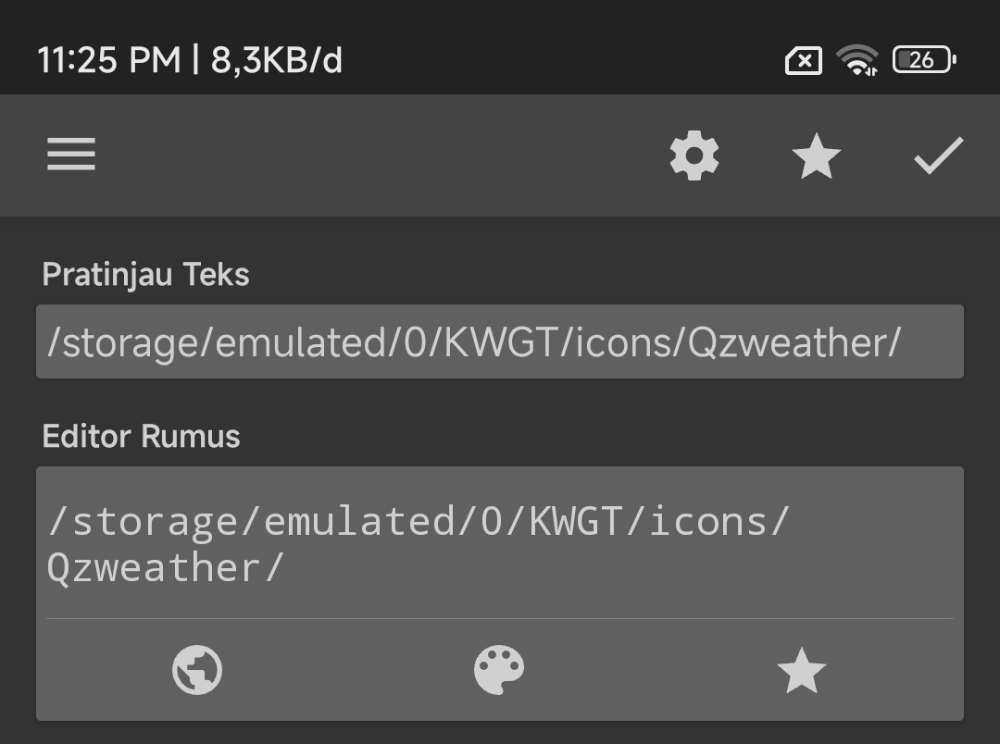

# QzWeather

Ini hanyalah Widget Weather Sederhana yang saya buat menggunakan Widget Maker KWGT 🤣.

## Tutorial
1. Download Repository ini dan terapkan Widget seperti biasa
2. Pergi ke Menu "**Global**"
    
    
3. "**Sentuh**" dan Pastekan dimana tempat anda menyimpan file **Folder Icon**.

    Pada contoh saya, saya menyimpan file ICON didalam _/storage/emulated/0/KWGT/icons/Qzweather/_
    
    
    Jadi tinggal copy dan pastekan saja path penyimpanan iconnya, lalu save ✔️
    
    
   
Video:
https://youtu.be/fCZ9Ss3uM1A